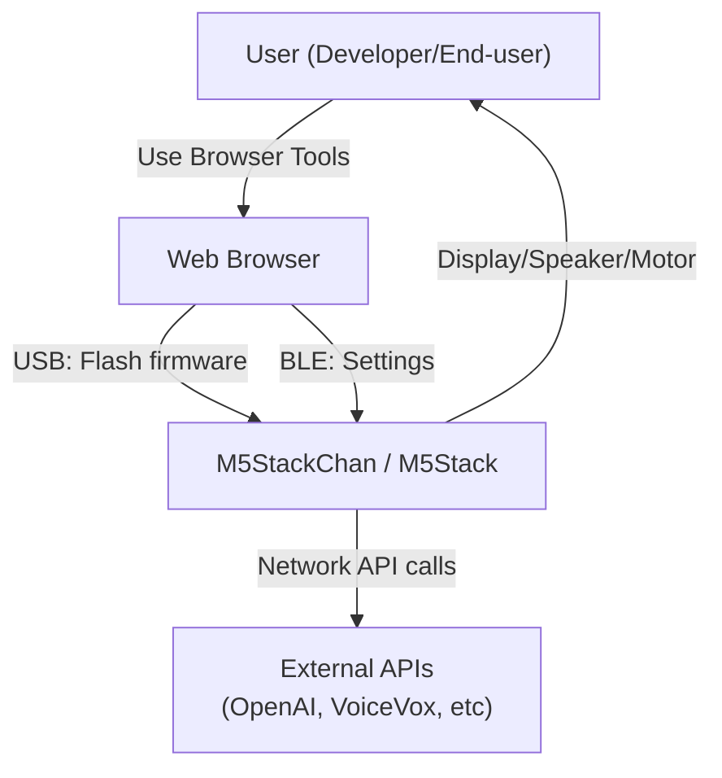
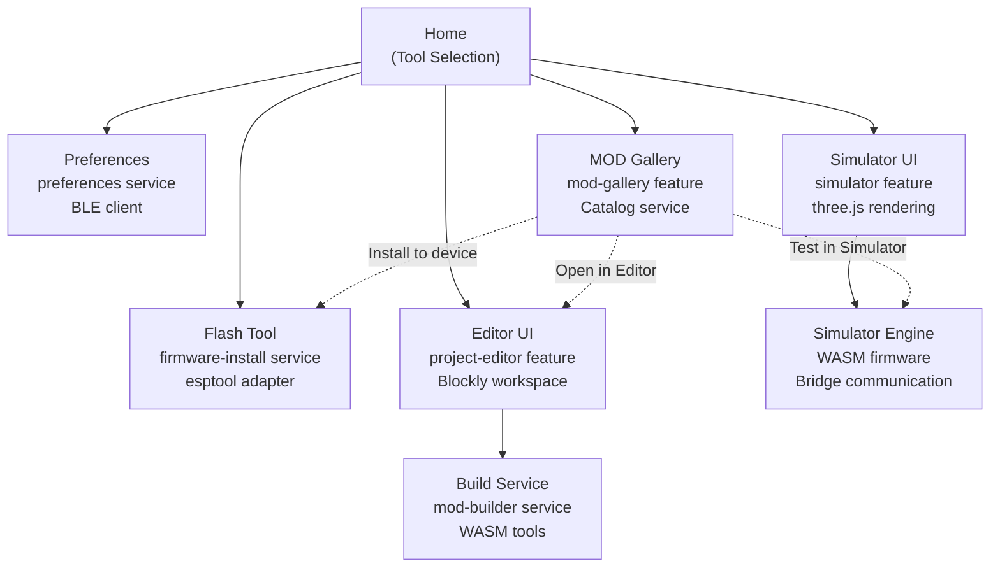

# Stack-chan アーキテクチャ

## System Context



## Components

### 1. ファームウェア側コンポーネント

#### Firmware Hierarchy

```
firmware/host/app/main.ts
├── startStackchanDock()
│   └── MOD Manager UI
├── initializeLocalization()
├── startHostBootServices()
│   ├── WiFi Connection
│   └── Network Ready Promise
├── createStackchanContext()
│   ├── Compose Motion Driver
│   ├── Compose TTS Engine
│   ├── Compose UI Controller
│   └── Initialize Capabilities
└── runContextCreatedBehaviors()
    └── MOD.onContextCreated(context, options)
        ├── Register Event Listeners
        ├── Start Application Loop
        └── Manage Lifecycle
```

#### Core Modules

| モジュール | 責務 | 主要ファイル |
| --- | --- | --- |
| **host/app** | アプリケーションエントリー・キャパビリティ合成 | main.ts, compose.ts, capabilities.ts |
| **host/modules/motion** | サーボ制御・キネマティクス計算 | motion-controller.ts, *-driver.ts |
| **host/modules/audio** | TTS・マイク・スピーカー制御 | tts-*.ts, microphone.ts, speaker.ts |
| **host/modules/ui** | 顔表現・ドロワーUI・エフェクト | face components, effects, app-controller |
| **host/modules/input** | ボタン・タッチ・IMU入力 | button, touch-panel, imu |
| **host/modules/connectivity** | BLE・WiFi・ローカルピア通信 | ble/services, preference-server |
| **host/modules/preferences** | 設定読込・永続化 | loadPreference.ts |

#### Key Service Pattern: Dependency Injection

```typescript
// firmware/host/app/compose.ts
export function createStackchanContext(preferences: PreferenceConfig) {
  // 1. Setup driver factory map
  const drivers = new Map<string, (param: unknown) => MotionDriver>([
    ['scservo', param => new SCServoDriver(param)],
    ['m5stackchan', param => new M5StackChanServoDriver(param)],
    ['dynamixel', param => new DynamixelDriver(param)],
    // ...
  ])
  
  // 2. Setup TTS factory map
  const ttsEngines = new Map<string, (param: unknown) => TTS>([
    ['local', param => new LocalTTS(param)],
    ['openai', param => new OpenAITTS(param)],
    ['voicevox', param => new VoiceVoxTTS(param)],
    // ...
  ])
  
  // 3. Setup UI factory map
  const uiControllers = new Map<string, (param: unknown) => RobotUI>([
    ['dog', param => createStackchanUI(new DogFace(), param)],
    ['simple', param => createStackchanUI(new SimpleFace(), param)],
    // ...
  ])
  
  // 4. Resolve preferences to implementation
  const driverKey = preferences.driver.type ?? 'scservo'
  const ttsKey = preferences.tts.type ?? 'local'
  const uiKey = preferences.ui.type ?? 'simple'
  
  // 5. Instantiate resolved implementations
  const driver = drivers.get(driverKey)!(driverPrefs)
  const tts = ttsEngines.get(ttsKey)!(ttsPrefs)
  const ui = uiControllers.get(uiKey)!(uiPrefs)
  
  // 6. Compose into context
  const context = new StackchanRuntimeContext({
    driver, ui, tts, touch, imu, camera, microphone, speaker, ...
  })
  
  return context
}
```

### 2. Web側コンポーネント

#### Application Structure

```
web/
├── vite.config.ts                    # Multi-page SPA config
├── src/
│   ├── entries/                      # Page entry points
│   │   ├── home.tsx                  # Tool selection
│   │   ├── flash.tsx → Flash tool
│   │   ├── editor.tsx → Block editor
│   │   ├── simulator.tsx → WASM simulator
│   │   ├── preference.tsx → BLE settings
│   │   ├── mod-gallery.tsx → MOD discovery
│   │   └── ...
│   ├── features/                     # Feature modules
│   │   ├── project-editor/           # Blockly + MOD builder
│   │   ├── simulator/                # WASM + 3D rendering
│   │   ├── firmware-install/         # USB flashing
│   │   ├── mod-gallery/              # Catalog UI
│   │   ├── preferences/              # BLE settings
│   │   └── ...
│   ├── services/                     # Cross-cutting services
│   │   ├── esptool/                  # USB communication
│   │   ├── simulator/                # WASM engine
│   │   ├── firmware-install/         # Flashing logic
│   │   ├── mod-builder/              # Build orchestration
│   │   ├── mod-gallery/              # Catalog loading
│   │   ├── preferences/              # BLE client
│   │   └── ...
│   ├── components/                   # Reusable UI components
│   ├── app/                          # App shell + theming
│   └── lib/                          # Utilities
├── flash/                            # Firmware flasher
├── editor/                           # Editor + Blockly blocks
├── simulator/                        # WASM fw + geometry
├── preference/                       # Preference UI
├── mod-gallery/                      # Gallery UI
├── face-editor/                      # Face designer
└── mediapipe/                        # Face tracking
```

#### Feature Modules



### 3. Conversation Gateway コンポーネント

リポジトリルートの`gateway/`は、ファームウェアともWebツールとも別に動く常駐Node.jsサービスです。Stack-chanを特定のLLMに固定しないため、会話は4層に分かれます。

```text
Stackchan = body + UI + sensors
Gateway   = conversation infrastructure
Agent     = the brain
MCP       = hands into the outside world
```

Gatewayはファームウェアの`stackchan.event.v1`制御プレーンと、Android USB Dockがすでに話すRealtime制御プレーンをそのままWebSocket越しに話すDockとして実装されており（`firmware/host/app/docks/gateway/`）、`RemoteConversationSession`など既存の会話基盤を変更せずに再利用します。詳細は[Conversation Gateway仕様](./specs/conversation-gateway.md)を参照してください。

## Dependency Direction

### Firmware

```
├─ Frameworks
│  ├─ Moddable SDK (XS Runtime)
│  └─ Timer, WebSocket, Preference APIs
│
├─ Modules (Abstraction Layer)
│  ├─ Motion Driver Interface ← Multiple implementations
│  ├─ TTS Engine Interface ← Multiple implementations
│  ├─ UI Framework (Piu)
│  └─ Input/Connectivity/Preferences
│
├─ App (Composition)
│  ├─ createStackchanContext() composes modules
│  ├─ StackchanRuntimeContext implements StackchanContext
│  └─ Default Behaviors
│
├─ MOD (User Application)
│  └─ Receives StackchanContext
│  └─ Calls capability methods
│
└─ (External)
   ├─ OpenAI API (TTS/ChatGPT)
   ├─ VoiceVox API (TTS)
   ├─ WebSocket servers (Custom services)
   └─ BLE (Preferences, LocalPeer)
```

### Web

```
├─ Frameworks
│  ├─ React 19
│  ├─ Vite (Build)
│  ├─ Blockly 13
│  └─ three.js
│
├─ Services (Business Logic)
│  ├─ esptool-adapter (USB)
│  ├─ firmware-install-service (Flashing)
│  ├─ mod-builder-service (Build)
│  ├─ ble-preference-client (BLE)
│  ├─ simulator-engine (WASM)
│  └─ mod-catalog-service (Gallery)
│
├─ Features (UI)
│  ├─ firmware-install (uses esptool-adapter)
│  ├─ project-editor (uses mod-builder-service)
│  ├─ simulator (uses simulator-engine)
│  ├─ preferences (uses ble-preference-client)
│  ├─ mod-gallery (uses mod-catalog-service)
│  └─ ...
│
├─ Components (Reusable UI)
│  └─ Generic UI building blocks
│
└─ (External)
   ├─ Web Serial API (USB)
   ├─ Web Bluetooth API (BLE)
   ├─ IndexedDB (Storage)
   └─ Moddable Tools WASM
```

## Runtime Flow

### ファームウェア起動フロー

```
1. Bootloader (ESP32)
   └─ Load main.ts

2. main.ts (Firmware Entry)
   ├─ Modules.initialize()
   ├─ startStackchanDock()
   │  └─ Show MOD Manager UI
   ├─ loadAppBehaviors()
   │  └─ resolveAppBehaviors() - Check for MOD override
   ├─ prepareAppLaunch()
   │  └─ Run onLaunch handlers
   │     ├─ Show splash screen
   │     ├─ Let user choose: Boot/MOD/Setup
   │     └─ If MOD selected, load from storage
   │
   ├─ startHostBootServices()
   │  ├─ WiFi connection (if configured)
   │  └─ Wait for network.ready
   │
   ├─ loadPreferenceConfig()
   │  ├─ Read mc/config
   │  ├─ Read mod/config
   │  └─ Read Preference XS store
   │
   ├─ createStackchanContext(preferences)
   │  ├─ Select motion driver based on preferences.driver.type
   │  ├─ Select TTS engine based on preferences.tts.type
   │  ├─ Select UI based on preferences.ui.type
   │  ├─ Initialize input devices (button, touch, imu)
   │  ├─ Initialize sensors (camera, microphone)
   │  ├─ Initialize connectivity (BLE server, network)
   │  └─ Create StackchanRuntimeContext
   │
   ├─ ownedDock?.onContextCreated(context)
   │  └─ Notify MOD manager
   │
   ├─ registerExperimentalMiniApps()
   │
   ├─ runContextCreatedBehaviors(appBehaviors, context)
   │  └─ Call MOD.onContextCreated(context, options)
   │     └─ MOD Initialization & Event Loop
   │
   └─ 🎯 Application Ready
      └─ MOD is running with full context access

3. MOD Execution Loop
   ├─ onContextCreated() called once
   ├─ Timer.repeat() for periodic tasks
   ├─ Event handlers on input
   ├─ Async operations (API calls, etc)
   └─ Lifecycle hooks (onClose when shutting down)
```

### ブラウザ側フロー

```
1. Page Load (e.g., editor.html)
   └─ Vite loads entry point (src/entries/editor.tsx)

2. App Initialization
   ├─ App Shell mounts
   ├─ Theme provider
   ├─ I18n provider
   └─ Feature component renders

3. Feature Initialization (Project Editor)
   ├─ Load project from IndexedDB
   ├─ Initialize Blockly workspace
   ├─ Setup event listeners
   └─ Render UI

4. User Action: Build MOD
   ├─ Blockly workspace → source code
   ├─ Trigger mod-builder-service
   │  └─ Web Worker (mod-build.worker)
   │     ├─ Embed assets in manifest
   │     ├─ Create virtual filesystem
   │     ├─ Run WASM Moddable tools
   │     └─ Generate XS archive (.xsa)
   ├─ Return archive to main thread
   └─ Ready for simulator or device

5. User Action: Flash to Device
   ├─ Select USB port
   ├─ esptool-adapter → Transport
   ├─ esptool.js → Chip detection
   ├─ Load firmware binaries from manifest
   ├─ Write to ESP32 flash memory
   └─ Device restarts with new firmware

6. User Action: Simulate
   ├─ Load WASM firmware (mc.js + mc.wasm)
   ├─ Create Bridge communication layer
   ├─ Install MOD archive into WASM fs
   ├─ Start 3D rendering loop
   ├─ Inject UI events (button press, touch)
   └─ Display output on canvas
```

## Data Flow

### MOD 実行 → モーション制御フロー

```
MOD code:
  robot.motion.lookAt([0.6, -0.3, 0.1])
           ↓
StackchanRuntimeContext.motion.lookAt()
           ↓
MotionController.lookAt(position)
  ├─ Store gaze point
  └─ Trigger face update
           ↓
Face Update Loop (30 Hz)
  ├─ Calculate eye rotation from servo angles + gaze
  ├─ Update FaceState object
  └─ Call RobotUI.update(faceState)
           ↓
Piu UI Frame
  ├─ Eye pupils move to new position
  ├─ Mouth animates if speaking
  └─ Render to LCD screen
```

### MOD 実行 → 音声出力フロー

```
MOD code:
  await robot.audio.say("Hello, world!")
           ↓
StackchanRuntimeAudio.say(text, volume)
           ├─ Get current TTS engine (e.g., OpenAI)
           └─ Call tts.synthesize(text)
           ↓
OpenAI TTS (example)
  ├─ HTTP request → OpenAI API
  ├─ Receive MP3 audio bytes
  └─ Return audio buffer
           ↓
StackchanRuntimeAudio.playback
  ├─ Parse audio frames
  ├─ Send to Speaker device
  ├─ Update mouth animation based on volume
  └─ Emit onPlayed callback
           ↓
Device Speaker
  └─ Output sound
```

### ブロックエディタ → デバイスへの MOD インストールフロー

```
User: Click "Build and Install"
           ↓
Blockly workspace.snapshot()
  └─ Export workspace XML
           ↓
Generate JavaScript code from blocks
  ├─ Block definitions in blocks.mjs
  └─ JavaScript output code
           ↓
Create VisualProject
  ├─ Workspace JSON
  ├─ Generated source
  └─ Assets (images, fonts)
           ↓
buildVisualProjectMod(project)
  ├─ Web Worker (mod-build.worker)
  ├─ WASM Moddable tools
  ├─ Create MOD manifest
  ├─ Compile TypeScript/JavaScript
  └─ Package into XS archive (.xsa)
           ↓
installModToDevice(archive)
  ├─ Establish USB serial connection
  ├─ Send archive bytes over esptool
  └─ Device flashes to XS partition
           ↓
Device reboots
  ├─ Bootloader loads firmware
  ├─ Firmware checks for installed MOD
  ├─ Load MOD from partition
  └─ Execute MOD.onContextCreated()
           ↓
🎯 MOD Running on Device
```

## Database / Persistence

### Firmware Side

**Preference Storage** (XS Preference API)

```
Preference.set(domain: string, key: string, value: any)
Preference.get(domain: string, key: string): any

Domains:
  "wifi"     → SSID, password
  "driver"   → Motor driver type, baud rate
  "ui"       → UI type, language
  "tts"      → TTS engine, API key, host/port
  "ai"       → OpenAI token, context
  "led"      → LED configuration
  "mcp"      → Codex Voice token
  "time"     → Timezone
```

**Persistent Locations**
- M5StackChan Core S3: Internal Flash (`nvs` partition)
- Other M5Stack: SD card or internal Flash depending on model

### Web Side

**Project Storage** (IndexedDB)

```
Database: "stackchan-projects"
Object Stores:
  - "current"     → Current project ID + metadata
  - "projects"    → VisualProject[] array
                    (stored as single document)

VisualProject structure:
  {
    id: string,
    format: "stackchan-blocks-v2",
    version: number,
    name: string,
    target: "simulator" | "device",
    workspace: BlocklyWorkspace JSON,
    source: Generated JavaScript,
    assets: Asset[],
    generatedAt: timestamp
  }

Max sizes:
  - 20 assets per project
  - 1 MB per asset
  - 2 MB total project JSON
```

**Fallback** (localStorage)

```
Key: "stackchan-visual-project-v1"
Used when IndexedDB unavailable
Stores JSON-stringified VisualProject

Limited by ~5-10 MB browser localStorage limit
```

## External Integrations

### API Integrations

```
┌─ OpenAI API
│  ├─ TTS: text → audio
│  ├─ ChatGPT: text → AI response
│  └─ Auth: Bearer token (preferences.ai.token)
│
├─ VoiceVox
│  ├─ TTS: text → audio
│  ├─ Local (on-prem) or Web API
│  └─ Config: host:port (preferences.tts.host/port)
│
├─ ElevenLabs
│  ├─ TTS: text → audio
│  └─ Auth: API key (preferences.tts.token)
│
├─ Custom WebSocket Servers
│  ├─ Speech-to-text server
│  ├─ Custom AI backend
│  └─ MOD connects via `new WebSocket(url)`
│
└─ Codex Voice (MCP)
   ├─ Voice call + AI assistant
   └─ Auth: API token (preferences.mcp.token)
```

### Wireless Protocols

```
┌─ WiFi (Optional)
│  ├─ MOD can make HTTP/WebSocket requests
│  ├─ External API calls
│  └─ Configured via preferences.wifi
│
├─ BLE (Bluetooth Low Energy)
│  ├─ Preferences server (write settings from web)
│  ├─ LocalPeer messaging (device-to-device)
│  ├─ UUID: 6e400001-b5a3-f393-e0a9-e50e24dcca9e (Nordic UART Service)
│  └─ Web Bluetooth API on browser side
│
└─ ESP-NOW (Short range)
   ├─ Ultra-low latency device messaging
   └─ LocalPeer transport option
```

## Authentication / Authorization

### Firmware

**Token Management** (Preferences)

```
preferences.ai.token         → OpenAI API key
preferences.tts.token        → ElevenLabs/VoiceVox API key
preferences.mcp.token        → Codex Voice API key
preferences.tts.host/port    → VoiceVox server endpoint
```

**Security Model**
- Tokens stored in Preference XS (device-local)
- Not transmitted over BLE to web tools
- MODs can read preferences via `options.config`
- No explicit auth layer; relies on token secrecy

### Web

**BLE Preferences Server**
- No authentication between web and device (local-only)
- Assumes same physical location/trusted network
- Future: PIN or challenge-response

**USB Firmware Flashing**
- Web Serial API gates USB access to browser tab
- User must grant port permission each time
- No credential storage on web side

## Error Handling

### Firmware Error Patterns

**Preference Loading** (`loadPreference.ts`)
```typescript
try {
  const modConfig = Modules.importNow('mod/config')
} catch (error) {
  trace(`[preferences] mod config unavailable: ${error.message}\n`)
  // Fallback to mc/config
}
```

**TTS Fallback** (`compose.ts`)
```typescript
const ttsKey = ttsPrefs.type ?? 'local'  // Default to local TTS
const TTS = ttsEngines.get(ttsKey)
if (!TTS) {
  throw new Error(`TTS engine "${ttsKey}" not found`)
}
```

**Capability Availability** (`compose.ts`)
```typescript
const microphone = Modules.has('audio-in') ? new Microphone() : undefined
// MOD must check: if (context.audio.microphone) { ... }
```

### Web Error Patterns

**USB Flashing** (`firmware-install-service.ts`)
```typescript
try {
  const loader = new ESPLoader(transport)
  await loader.connect()
} catch (error) {
  // User feedback: "Failed to connect to device"
  // Retry UI with retry button
}
```

**BLE Connection** (`ble-preference-client.ts`)
```typescript
const device = await navigator.bluetooth.requestDevice()
try {
  await client.connect()
} catch (error) {
  // Timeout → "Device not responding"
  // Permission denied → "Grant Bluetooth access"
}
```

**MOD Build** (`mod-build-service.ts`)
```typescript
try {
  const archive = await buildMOD(project)
} catch (error) {
  // Validation error → Show syntax errors to user
  // Compilation error → Show xsc output
}
```

## Async / Queue / Event Processing

### Firmware Event System

**Button Events**

```typescript
robot.input.button.a.onEvent = (event) => {
  if (event.pressed) {
    trace('Button A pressed\n')
  }
  if (event.released) {
    trace('Button A released\n')
  }
}
```

**Timer & Async**

```typescript
import Timer from 'timer'

// Repeated task
Timer.repeat(() => {
  robot.motion.lookAt(newTarget)
}, 5000)  // Every 5 seconds

// Async audio
await robot.audio.say("Hello")

// Promise-based
robot.lifecycle.close().then(() => {
  trace('MOD stopped\n')
})
```

**Lifecycle Cleanup**

```typescript
await context.lifecycle.close()
// Closes:
// 1. Timers (if created via Timer API)
// 2. Sensor subscriptions (touch, imu)
// 3. Camera sessions
// 4. Motion timers
// Called on shutdown or MOD unload
```

### Web Async Patterns

**React Suspense + Error Boundary**

```typescript
// Feature component
const projects = await db.loadProjects()
return <ProjectList projects={projects} />
```

**Operation State Pattern**

```typescript
type OperationState<T> = 
  | { status: 'idle' }
  | { status: 'loading' }
  | { status: 'success'; value: T }
  | { status: 'error'; error: Error }

const [state, setState] = useState<OperationState<Archive>>({ status: 'idle' })
```

**Web Worker for Long Tasks**

```typescript
// Main thread
const archive = await modBuildService.buildMod(project)

// Service (uses Web Worker)
private worker = new Worker('mod-build.worker.ts')
buildMod(project) {
  return new Promise((resolve, reject) => {
    this.worker.postMessage(project)
    this.worker.onmessage = (e) => resolve(e.data)
  })
}
```

## Deployment Architecture

### Firmware Release

```
firmware/
├─ Develop on `develop` branch
├─ Tag release (e.g., v1.1.0)
└─ CI builds all targets
   ├─ m5stack (original)
   ├─ m5stack_core2
   ├─ m5stack_cores3
   ├─ m5stackchan_cores3 (primary)
   └─ Publish to GitHub Releases as ZIP

Web Flash Tool
  └─ Users download pre-built binaries from release
  └─ Flash via USB using esptool-js
```

### Web Deployment

```
web/
├─ Develop on `develop` branch
├─ Build: npm run build
│  ├─ Compiles TypeScript + Vite optimization
│  ├─ Generates dist/ with multiple entry points
│  └─ Copies runtime assets (WASM, samples, catalog)
├─ Deploy to GitHub Pages
│  └─ Served at https://kumakumapon.github.io/stack-chan/develop/web/
└─ Each tool accessible at /web/flash/, /web/editor/, etc.
```

### CI/CD Pipeline

```
GitHub Actions (.github/workflows/)
├─ build.yml
│  ├─ Triggered on: push to develop/main, PR
│  ├─ Jobs:
│  │  ├─ Setup environment (Moddable SDK)
│  │  ├─ Lint & type check
│  │  ├─ Run tests
│  │  ├─ Build firmware
│  │  └─ Build web tools
│  └─ Artifacts stored for manual testing
│
├─ bundle.yml
│  ├─ Triggered on: tag push (release)
│  ├─ Builds all firmware targets
│  └─ Publishes release assets
│
└─ cloudflare-preview.yml
   ├─ Preview deployment on each PR
   └─ Links added to PR comments
```

## Architectural Constraints

1. **XS Version Pinned**: Moddable XS version fixed for firmware stability
2. **ESP32 Only**: Hardware target is ESP32 (M5Stack family)
3. **JavaScript Ecosystem**: Entire firmware in JavaScript (no C/Rust)
4. **Network Optional**: MOD should work offline; network is optional
5. **Low Memory**: Device has limited RAM; MODs should be <1 MB
6. **BLE Bandwidth**: Preference updates must fit in BLE 128-byte MTU
7. **Single MOD**: Only one MOD active at a time (replaces host behavior)
8. **Browser Sandbox**: Web tools run in browser; no server backend for flashing
9. **Offline-First**: All development tools work offline (WASM compiler)
10. **Backward Compatibility**: API changes must not break existing MODs
