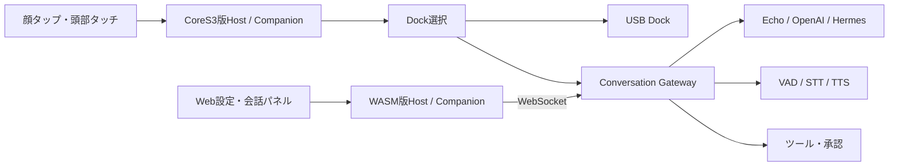

# 現在の実装状況

整理日: 2026-09-19。対象は **PR #42を含むコード**（実装基準: `27af4cdb`）です。
[PR #42](https://github.com/kumakumapon/stack-chan/pull/42)の内容を含むため、公開済みリリースの機能一覧とは区別してください。

## 全体構成

| 層 | 現在の役割 | 実装・説明の入口 |
| --- | --- | --- |
| Host | 起動、設定、能力の合成、MODの実行と終了処理 | [main.ts](../firmware/host/app/main.ts)、[capabilities.ts](../firmware/host/app/capabilities.ts) |
| Companion | 標準の起動挨拶、待機リアクション、遊びメニュー、会話操作 | [companion.ts](../firmware/host/app/default-behavior/companion.ts) |
| MOD / mini app | Hostの能力を使う追加アプリケーション | [MOD開発](../firmware/mods/README_ja.md) |
| Dock | Gateway / USBの接続先選択と会話の有効化・解除 | [conversation-router.ts](../firmware/host/app/docks/conversation-router.ts) |
| Gateway | 会話セッション、VAD/STT/TTS、Agent、ツール、承認 | [Gateway](../gateway/README.md)、[日本語仕様](specs/conversation-gateway_ja.md) |
| Web | 書き込み、設定、Gallery、ブロック／顔エディタ、WASMシミュレータ | [Webツール](../README_ja.md#webツール) |
| 機種別実装 | サーボ、音声、入力、カメラなどのハードウェア差分 | [firmware/host/platforms](../firmware/host/platforms)、[開発ガイド](../firmware/README_ja.md) |

上表はコードの所在と責務を整理したものです。各機能の実機での品質や、すべての機種での利用可否を保証する表ではありません。

ブラウザはWASM版でも通信・音声入出力を担当します。会話状態、ツールの実行、Companionの振る舞いはファームウェア側です。
Direct-modeのChatServiceを使うMODもあり、すべてのAI連携がGateway経由に置き換わったわけではありません。

## Companionと会話操作

標準M5StackChan CoreS3とWASMでは、起動後の挨拶、控えめな待機リアクション、挨拶／歌／踊りなどのメニューを持ちます。
会話、MOD、音声、リアクション、パフォーマンスが動いている間は、待機動作が割り込まないよう制御します。

| 操作・設定 | 現在の動作 |
| --- | --- |
| `conversation.backend` | `none` / `gateway` / `usb`。標準の未設定時はnone。専用manifestには個別の既定値がある |
| `conversation.autoStart` | 有効なら起動後に選択した会話を開始 |
| 顔タップ | Gatewayの認識中・発話中は応答を中断。それ以外は会話の開始／停止 |
| 頭部タッチ | 撫でる操作。顔タップの会話操作とは別 |
| Web「応答を中断」 | 現在の応答を止め、確認応答後に会話の待受けへ戻る |
| Web「会話を停止」 | 会話を終了し、マイク・再生・有効化中の資源を解放 |
| `gateway.microphone` | 初期値OFF。明示的に有効化した場合だけマイク送信 |

設定手順は[Companion運用ガイド](operations/companion-mode.md)を参照してください。

## Gateway音声・中断の実装状況

| 項目 | 実装済みの動作 | 制約・残件 |
| --- | --- | --- |
| テキスト会話 | Web入力 → Agent → 応答表示・音声 | Gatewayの接続先・認証設定が必要 |
| マイク入力 | PCM16 / 16 kHz / mono、20 msフレーム。ネイティブのステレオ入力は平均してmonoへ変換 | 初期値OFF。認識中・再生中は送信停止する半二重方式 |
| ローカルTTS | Gatewayが音声出力を提供しない場合に最終テキストを読み上げ | 選択したTTS・ターゲットに依存 |
| Gateway音声再生 | 受信したPCMを逐次再生。Native AudioOutとWeb Audioで共通のキュー管理 | PCMキュー64 KiB、最大3バッファを先行投入。上限超過時は停止・エラー |
| 再生完了 | `audio.completed`受信後も、キューの再生完了まで待って入力再開 | 実スピーカーの末尾とDMAのタイミングは実機確認対象 |
| 応答中断 | ローカル音声を即時停止し、`response.cancel`を送信。`response.cancelled`確認後に待受けへ戻る | 確認待ちは5秒。対応GatewayとFirmwareを併せて更新する |
| 遅延した応答 | 中断・停止前の合成、STT、tool結果、HTTP応答、再生完了を次の会話へ持ち越さない | すでに実行した外部ツールの副作用を取り消す機能ではない |
| 身体操作 | `stackchan.react`、`stackchan.perform`ほか、デバイスが広告したツールを利用 | 実機固有の可動域・音量・LED等は別途確認 |
| `robot.directive` | 将来拡張用の予約。受信しても実行しない | 身体操作には既存tool/approval経路を使う |

Gateway側はVADで発話の区切りを決め、STT結果をAgentに渡します。TTS出力は20 msパケットに分割し、再生速度に合わせて送ります。
デバイス側はPiuに依存しないPCMシンクを使い、応答全体をためてから再生する旧方式を置き換えています。
常時マイクを開く全二重方式、音声検出による割り込み、AECは未実装です。

主な実装:
[Dock runtime](../firmware/host/app/docks/gateway/runtime.ts)、
[Presentation](../firmware/host/app/docks/gateway/presentation.ts)、
[PCM queue](../firmware/host/app/docks/gateway/pcm-stream.ts)、
[Gateway session](../gateway/src/conversation/conversation-session.ts)。

## HTTP接続管理

HttpServerServiceとMCPServerServiceはSDKのlisten()を使い、1応答ごとに`Connection: close`で接続を閉じます。
HTTPサーバーではカスタム応答、404、500にもこの方針を適用し、指定したHTTPステータスも正しく返します。

これはSDKのkeep-alive状態再利用によるVM停止への対策です。**SDK自体のkeep-alive修正ではありません。**
MCP側のclose対策も維持しており、LGPLのSDK実装をvendorへ取り込んではいません。
背景と回帰テストは[HTTP接続方針](../firmware/host/modules/connectivity/http-server/README.md)にまとめています。

## 検証済み範囲と実機の残件

以下は基準コミットに対する検証結果です。

| 検証 | 確認できたこと |
| --- | --- |
| Firmware Node / XS / architecture / lint | 状態管理、PCMキュー、キャンセル、実HTTPサーバーへの連続アクセス、依存境界 |
| Gateway | 144テスト成功。Echo / OpenAI / Hermesのキャンセルはモック通信で検証 |
| Web / WASM + localhost Gateway | 応答完了前の再生、中断、次の会話、停止後のエラーなし、表情・動作ツール、合成マイク入力 |
| リリースビルド | m5stack、m5stack_core2、m5stack_cores3、m5stackchan_cores3、stackchan_rt、takao_core2_sg90 |
| 配布物 | バンドル生成とCoreS3の生成リンカー表で必要なモジュールを確認 |

CI記録:
[Build / XS / WASM](https://github.com/kumakumapon/stack-chan/actions/runs/35434841943)、
[Release / Bundle](https://github.com/kumakumapon/stack-chan/actions/runs/35434842118)、
[Gateway](https://github.com/kumakumapon/stack-chan/actions/runs/35434841962)。

実機は未接続です。ビルド成功を実機動作確認とは扱いません。
実マイクの音量・STT精度、スピーカーの途切れ・末尾、物理タップ、サーボ範囲、Wi-Fi復帰、USB切替などは
[Issue #43](https://github.com/kumakumapon/stack-chan/issues/43)の未実施チェックリストで管理します。
ブラウザの自動試験は合成入力を使い、物理マイクや有料AIサービスには接続していません。

## 次に確認すること

1. Issue #43の実機受け入れ確認を行い、結果と使用ターゲットを記録する。
2. 発見した実機固有の不具合を個別Issueに分ける。
3. 全二重／AEC、SDK keep-alive、将来のdirectiveについては別の仕様・検証を設ける。

[ロードマップ](ROADMAP_ja.md)は将来計画です。機能の現在地は本ページ、詳細な契約は[Gateway仕様](specs/conversation-gateway_ja.md)、操作手順は[運用ガイド](operations/companion-mode.md)を入口にしてください。
